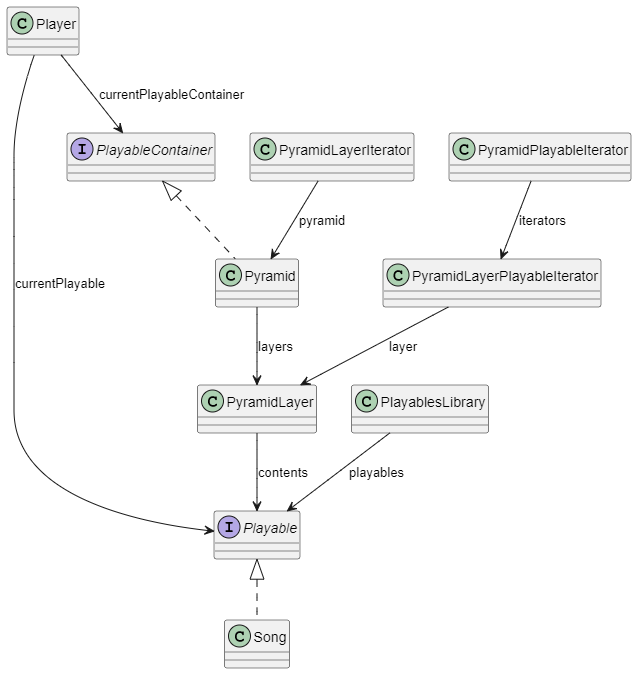

# Dokumentasjon av prosjektoppgave

## Del 1: Beskrivelse

Applikasjonen er et musikkprogram for å organisere sanger i en spesiell type spillelister, som blir kalt pyramider.

En pyramide består av flere nivåer, som hver har en bestemt vekt. Hvis en sang er på et nivå høyere oppe (med høyere vekt) enn en annen, vil denne sangen bli spilt av oftere.

Dette er implementert i kode ved hjelp av en klasse `Pyramid` som inneholder flere `PyramidLayer`, som har en liste over `Playable` (et interface, som `Song` implementerer). Klassen `Player` holder styr på hvilken sang som blir spilt akkurat nå og hvor neste sang hentes fra.

Selve utvelgelsen av neste sang i `Player` (hvis man spiller av en `Pyramid`) gjøres av klassen `PyramidPlayableIterator`, som basert på et tilfeldig tall og en liste over intervaller for hvert `PyramidLayer` (satt sammen av dens vekt og antall sanger i nivået), velger ut et `PyramidLayerPlayableIterator` å hente neste `Playable` fra. 

Brukergrensesnittet er ganske enkelt. Det brukes tre `ListView`, som inneholder henholdsvis lagene, sangene i valgt lag og en liste over sanger (hentet fra `PlayablesLibrary`) som man kan legge til i pyramidelagene. Det er også en spiller som speiler `Player`, med en "skip"-knapp for å gå til neste, og en meny for å legge til/fjerne lag.

## Del 2: Klassediagram

Diagramet under viser hvilket forhold de ulike klassene i applikasjonen har til hverandre. Det er ikke tatt med alle metodene og feltene i klassene, da det først og fremst var forholdet mellom dem jeg ville få frem i dette diagrammet.

## Del 3: Spørsmål

1. Hvordan ulike deler av pensum dekkes:
    1. *Interface*: Brukes grensesnitt for å type `Song` og `Pyramid` som henholdsvis `Playable` og `PlayableContainer`, da det er tenkt at det kan være en mulighet å implementere flere varianter, eksempelvis henholdsvis `Podcast` og `Album`. Ved å bruke grensesnittene i koden der det skal gis `Song`/`Pyramid` som parametre, vil det bli lettere å utvide programmet senere, da grensesnittene fortsatt kan stå som type.
    1. *Delegering*: `PyramidPlayableIterator` er et eksempel på en klasse som bruker delegering (gjennom å hente sine `Playable` fra flere andre `PyramidLayerPlayableIterator`) for å iterere gjennom `Playable`-ene i `Pyramid`.
    1. *Filhåndtering*: Brukes for å holde på tilstanden mellom sesjoner, i tillegg til å holde på dataen av tilgjengelige sanger å velge mellom (biblioteket).
    1. *Iteratorer*: Bruker iteratorer for å velge ut rekken av sangene som skal komme.
    1. *Observert-observatør-teknikken*: Brukes for å få beskjed om når endringer i valg i lister og slik i grensesnittet er gjort, slik at knapper dynamisk kan bli aktive/inaktive når de byr på lovlige handlinger.
    1. *Innkapsling, validering og lignende*: Brukes i (data)klassene for å sikre korrekt, lovlig tilstand.

1. I prosjektet brukes ikke arv, men det er noe det har blitt vurdert å bruke. For eksempel slik: Når det hadde blitt lagt til flere implementasjoner av `PlayableContainer` (for eksempel `Album`), kunne det vært aktuelt å gjøre `PlayableContainer` om til en abstrakt klasse som kunne holde den koden som var lik for de ulike subklassene (f. eks `Pyramid`).

1. Koden er delt ganske tydelig inn etter Model-View-Controller-prinsippet. Utformingen av grensesnittet er gjort i en egen FXML-fil som beskriver oppsettet. Logikken er skilt ut i filene i model-mappen, og kontrolleren brukes (nesten) kun for å koble sammen elementene i grensesnittet med deres tilhørende deler i modellen. For å sikre uavhengighet, ble så å si hele modellen laget før brukergrensesnittet ble påbegynt. Noen steder kan man kanskje likevel si at det er gjort tilpasninger i de ulike delene for å koble lettere sammen. Blant annet er det laget noen metoder i `Playable` som skal gi verdier som er lette å vise i et grensesnitt. For eksempel gir `Playable::getDisplayedArtist` strengen "Ukjent artist", dersom artist-verdien er `null`. Dette er kanskje ikke helt den mest optimale måten å gjøre det på, og det kan tenkes at det heller burde vært en del av kontrolleren, men det opplevdes underveis som å være en grei måte å gjøre det på uten at det skapte store avhengigheter mellom brukergrensesnittet og modellen.

1. For å teste applikasjonen er det laget en del enhetstester ved hjelp av JUnit som skal sikre at oppførselen for `Song` og `Pyramid` er som den er tenkt. Det hindrer også at man overser betydelige oppførselsendringer som kan forekomme om man senere endrer noe i koden. Alle deler av koden er ikke testet. Blant annet er det ikke gjort testing for å sjekke om sannsynlighetsdistribusjonen for `PyramidPlayableIterator` fungerer som tiltenkt. Denne er nedprioritert til fordel for `Song` og `Pyramid`, da det kan være vanskeligere å sikre stabile resultater for oppførsel som er basert på tilfeldige utvalg. Det er heller ikke laget egne tester for `PyramidLayer`, da disse kun kan opprettes som del av en `Pyramid` og det blir dermed sikret at deres oppførsel stemmer ved hjelp av testene for `Pyramid`. Det er også gjort utforskende testing av brukergrensesnittet for å passe på at kontrollen har koblet sammen modellen med brukergrensesnittet på riktig måte. Her er det ikke brukt automatiske tester, da det kan være litt mer knotete å få til enn ved testing av modellen. I tillegg er brukergrensesnittet så avgrenset i funksjonalitet og valg at det ikke er så krevende å teste alle delene av det manuelt. Det er også lite muligheter for fri brukerinput (kun i feltet for administrering av pyramidenivå), så de fleste feil som kunne ha skjedd er allerede begrenset av modellen (f. eks at man kun kan velge sanger blant en liste, ikke ved et felt.)